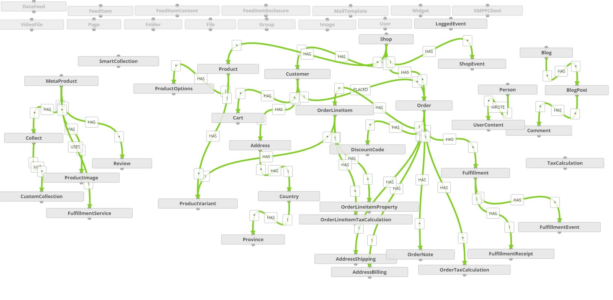

# Introduction
Structrify is an eCommerce Storefront aiming to be a functional substitute for many popular hosted ecommerce solutions, like Big Commerce, Squarespace, wordpress, et al.  It draws heavy inspiration from [Shopify's](http://shopify.com) 'graphy' data model and is an ideal candidate for implementation in [Structr](http://structr.org), an incredibly powerful CMS & rapid application development framework that uses the amazing [Neo4j](http://neo4j.com/) graph database.

### Project Status:  Immature. not yet usable

### Ways to Run Structrify
- On your own infrastructure, in AWS, linode, et al.
- Get a Hosted instance by [Structr](https://hosting.structr.com/)

Current Domain Model Overview

## Next round of // Todo
- [ ] Complete modeling attributes for products and product variants
- [ ] Complete modeling receipts and transactions
- [ ] Make function attribute usage consistent 
- [ ] abstract tag & concrete tags by assets type (product/product variant, customer, collection, etc)
- [ ] Convert a product template liquid file it's structrScript Equivalent  
- [ ] Import a Timber theme, create shared components
- [ ] Instruction on how to install Structr and import the Schema
- [ ] A method to page load assets from git directly into structr. 

  